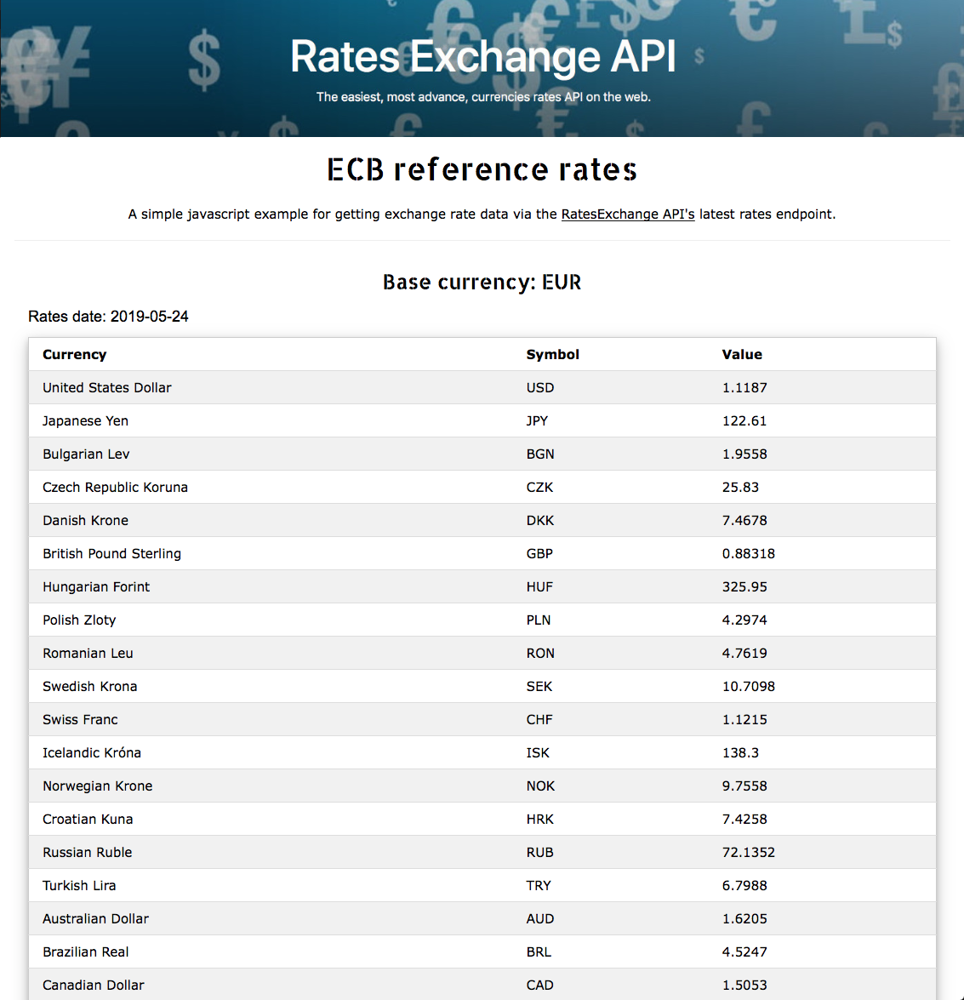

# RatesExchangeApi JS

A simple Javascript that displays exchange rates using the [Rates Exchange API](https://ratesexchange.eu).

RatesExchangeApi is a free JSON API for current and historical foreign exchange rates. It relies on daily feeds published by the European Central Bank.

## Usage
- You need an API key provided from the [Rates Exchange API](https://ratesexchange.eu/). It's free
- Clone this repo and edit the `getData.js` file
- Replace the `[REPLACE_THIS_VALUE_WITH_YOUR_ACCESS_KEY]` in `getData.js` with your own API key from rates exchange api
- Open the index.html with your browser. ECB latest rates should appear in your screen

## Communication

- Need help? Open an issue.
- Have a feature request? Open an issue.
- Find a bug? Open an issue.
- Want to contribute? Fork the repo and submit a pull request.

## Author

Vassilis Voutsas, voutsasva@gmail.com

## License

This project is released under the MIT license. See [LICENSE](https://github.com/voutsasva/RatesExchangeApi-JS/blob/master/LICENSE) for more information.
